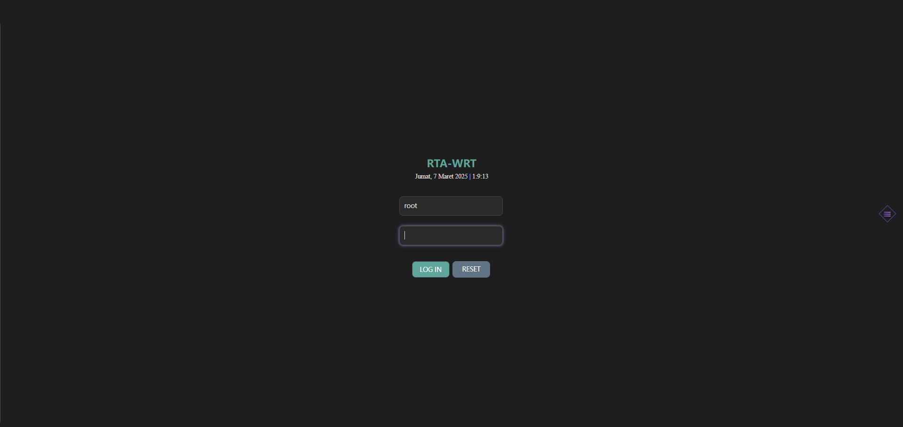
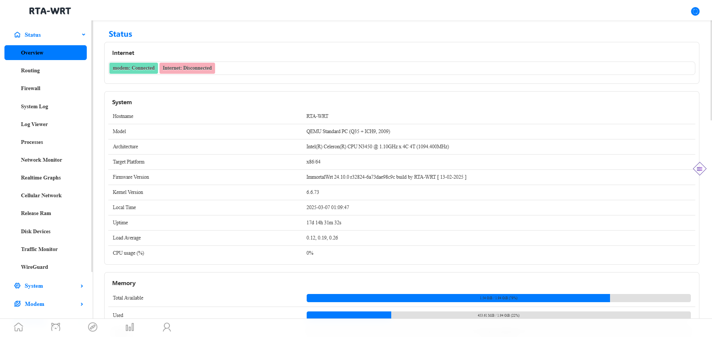
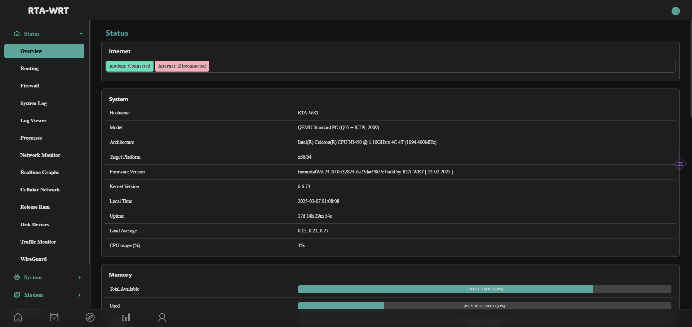

# 🌟 luci-theme-rtawrt 🌟

<p align="center">
    
</p>

**luci-theme-rtawrt** adalah tema HTML5 yang bersih dan modern untuk OpenWrt, dirancang berdasarkan prinsip-prinsip **Material Design**. Tema ini memberikan pengalaman pengguna yang intuitif dan responsif untuk mengelola perangkat OpenWrt Anda.

---

## ✨ **Fitur Utama**

- 🎨 **Desain Responsif**: Tampilan yang optimal untuk berbagai perangkat, mulai dari desktop hingga mobile.
- 🛠 **Integrasi LuCI**: Kompatibel penuh dengan antarmuka LuCI untuk mengelola pengaturan OpenWrt.
- 🌈 **Warna dan Gaya yang Dapat Disesuaikan**: Personalisasi tema sesuai preferensi Anda.
- ⚡ **Ringan dan Cepat**: Dibangun dengan performa tinggi untuk pengalaman yang mulus.

---

## 🖼 **Preview Tema**

Berikut adalah beberapa cuplikan tampilan tema **luci-theme-rtawrt**. Klik tombol di bawah untuk menampilkan atau menyembunyikan gambar.

<details>
<summary><strong>🎨 Tampilkan Preview Tema</strong></summary>

### Tampilan Login




### Tampilan Dashboard




</details>

---

## 📥 **Instalasi**

Berikut adalah panduan instalasi tema ini pada perangkat OpenWrt Anda:

1. **Unduh Paket**:

   - Untuk OpenWrt (IPK):
     ```bash
     opkg install luci-theme-rtawrt*.ipk
     ```
   - Untuk SNAPSHOT (APK):
     ```bash
     apk add luci-theme-rtawrt*.apk
     ```

2. **Aktifkan Tema**:

   - Buka LuCI → **System** → **System** → **Language and Style**.
   - Pilih **RTAWRT** dari dropdown **Design Theme**.

3. **Selesai**! Tema Anda sudah aktif dan siap digunakan.

---

## 🤝 **Berkontribusi**

Kami sangat menghargai kontribusi dari komunitas! Berikut cara Anda dapat berkontribusi:

1. **Laporkan Bug**: Buka [issue](https://github.com/rizkikotet-dev/luci-theme-rtawrt/issues) untuk melaporkan bug atau masalah.
2. **Kirim Pull Request**: Fork repositori ini, buat perubahan, dan kirim PR.
3. **Beri Masukan**: Saran dan masukan Anda sangat berarti untuk pengembangan tema ini.

**Panduan Kontribusi**:

- Pastikan kode Anda mengikuti standar yang ada.
- Jelaskan perubahan yang Anda buat dengan jelas di deskripsi PR.

---

## 📜 **Lisensi**

**luci-theme-rtawrt** dilisensikan di bawah **Apache License 2.0**. Anda bebas menggunakan, memodifikasi, dan mendistribusikan tema ini sesuai dengan ketentuan lisensi.

---

## 🔗 **Sumber Asli**

Tema ini didasarkan pada tema asli oleh [0x676e67](https://github.com/0x676e67/luci-theme-design). Kami berterima kasih kepada kontributor asli atas karyanya yang menginspirasi.

---

## 💬 **Dukungan dan Komunitas**

Bergabunglah dengan komunitas kami untuk mendapatkan bantuan, berbagi ide, atau sekadar berkenalan:

- [Forum OpenWrt](https://forum.openwrt.org)
- [Grup Telegram](https://t.me/backup_rtawrt)

---

## 🌟 **Dukung Kami**

Jika Anda menyukai tema ini, pertimbangkan untuk memberikan ⭐ di GitHub atau berdonasi melalui:

- [Saweria](https://saweria.co/rizkikotet)

---

**Selamat mencoba, dan semoga Anda menyukai tema ini!** 🎉
